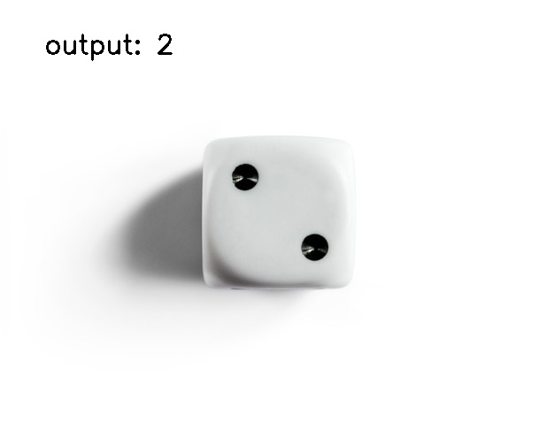
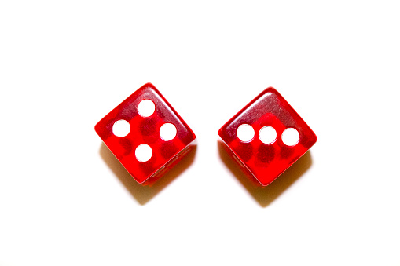
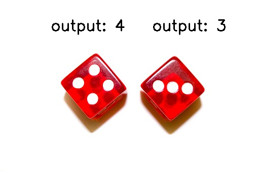
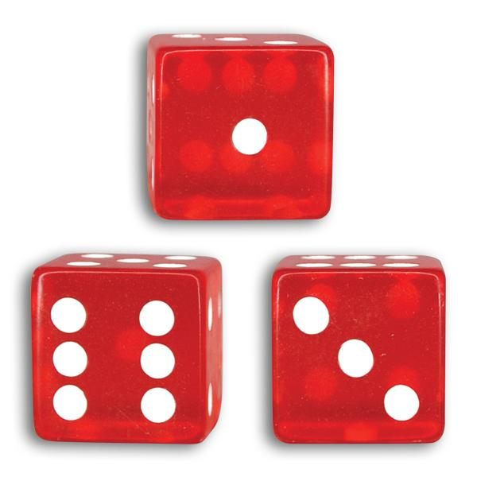
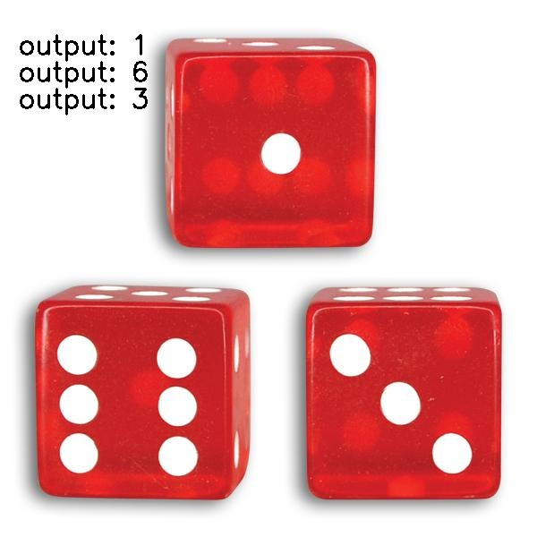

# Img_processing_7

## contourFunction Project :

créé en utilisant trois librairies importantes (OpenCV, math et matplotlib)

j'ai écrit un petit programme capable de trouver des contours dans une photoe au lieu de function (cv2.findContours()) en OpenCV et puis dessiner un rectangle autour du sujet.

> ### input:

> ### output:

---

## diceRecognition Project :

* utiliser (cv2.threshold) pour effectuer une simple segmentation de premier-plan en arrière-plan dans l'image.
* trouver des contours EXTERNAL avec (cv2.findContours) et séparer les dés.
* compter les cercles sur chaque dés et afficher le nombre sur la photo.

### Modèle 1 :
  

### Modèle 2 :

  

### Modèle 3 :

  
